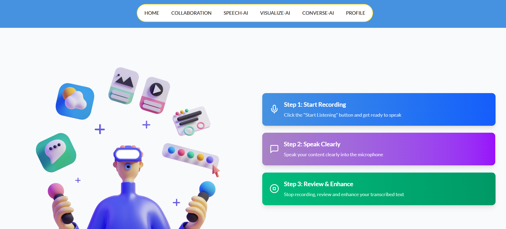
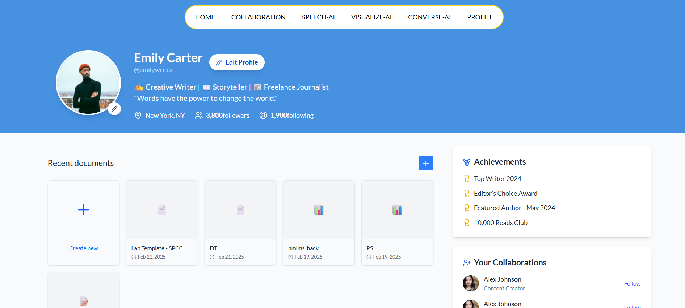

# CreatorSync

CreatorSync is a real-time collaborative writing platform built using React.js, Node.js, WebSockets, and MongoDB. It features AI-powered writing assistance via the Gemini API, version control, tone styling, speech-to-text functionality, and image generation from prompts.

---

## 🚀 Features

- Real-time collaborative text editing using WebSockets and Quill.js
- Version control with full edit history and content restoration
- AI-powered writing assistant using Gemini API
- Adaptive tone transformation (e.g., professional, poetic)
- Speech-to-text functionality for hands-free content creation
- AI-based image generation from user prompts

---
## 🖼️ Screenshots

### 🏠 Home Page  

### 🤖 AI Writing Assistant  

### 🎙️ Speech-to-Text Feature  

### 👤 User Profile Page  

--
## 🛠️ Tech Stack

| Technology     | Purpose                          |
|----------------|----------------------------------|
| React.js       | Frontend framework               |
| Node.js        | Backend runtime environment      |
| Express.js     | API routing                      |
| MongoDB        | NoSQL database                   |
| WebSockets     | Real-time editing                |
| Quill.js       | Rich text editor                 |
| Gemini API     | AI-powered suggestions & styling |

